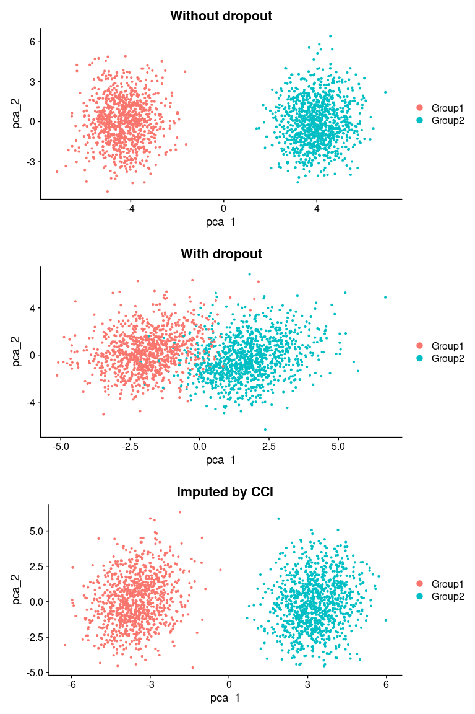
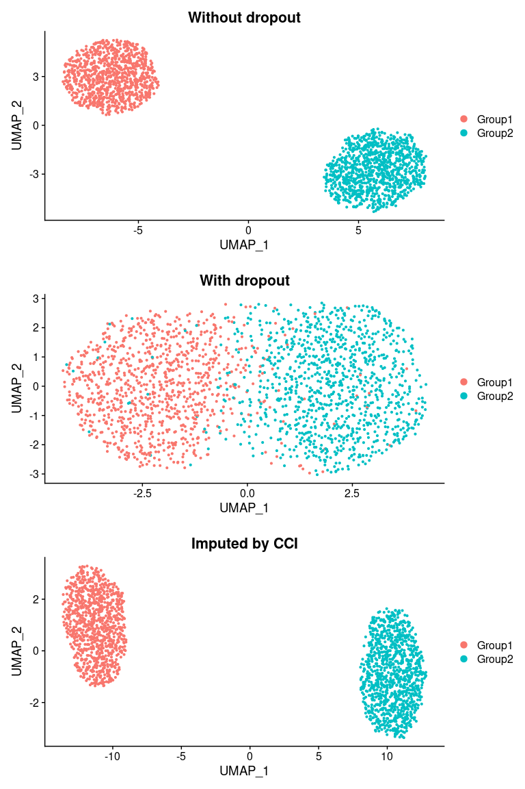

``` r
library(ccImpute)
library(Seurat)
library(splatter)
library(scater)
library(ggpubr)
```


``` r
set.seed(1)

# Parameters for data simulation
ngroups <- 2                 # Number of groups
batchCells <- 2000           # Number of cells in each batch
nGenes <- 500                # Number of genes
de.prob <- 0.1               # Proportion of differentially expressed (DE) genes
de.facLoc <- 0.3             # Location factor for DE effect
de.downProb <- 0.5           # Proportion of downregulated DE genes
de.facScale <- 0.1           # Scale factor for DE effect
dropout.type <- "experiment" # Type of dropout
dropout.mid <- 2             # Midpoint for dropout function
dropout.shape <- -1          # Shape parameter for dropout
```


``` r
# Simulated data without dropouts (sim1)
# -------------------------------------
params.groups <- newSplatParams(batchCells = batchCells, nGenes = nGenes, seed = 1)

# Simulate groups with Splatter
sim1 <- splatSimulateGroups(params.groups,
                            group.prob = rep(1, ngroups) / ngroups, # Equal group proportions
                            de.prob = de.prob,
                            de.facLoc = de.facLoc,
                            de.facScale = de.facScale,
                            de.downProb = de.downProb,
                            verbose = FALSE,
                            seed = 1)

# Normalize counts and run PCA
sim1 <- logNormCounts(sim1)
sim1 <- runPCA(sim1)

# Add placeholder dropout to sim1
params <- newSplatParams(batchCells = batchCells, nGenes = nGenes, seed = 1)
params <- setParams(params, update = list(dropout.type = "experiment", dropout.mid = -99999, seed = 1))
sim1 <- splatter:::splatSimDropout(sim1, params)

# Convert SingleCellExperiment object to Seurat object
sim1.s <- as.Seurat(sim1)
sim1.s$seurat_clusters <- as.numeric(as.factor(sim1$Group))
Idents(sim1.s) <- as.numeric(as.factor(sim1$Group))

# Process the Seurat object (Normalization, PCA, and UMAP)
sim1.s <- NormalizeData(sim1.s)
sim1.s <- FindVariableFeatures(sim1.s)
sim1.s <- ScaleData(sim1.s)
sim1.s <- RunPCA(sim1.s, features = VariableFeatures(sim1.s), verbose = FALSE)
sim1.s <- RunUMAP(sim1.s, dims = 1:10, verbose = FALSE)

# Simulated data with dropouts (sim2)
# -----------------------------------
params <- newSplatParams(seed = 1)
params <- setParams(params, nGenes = nGenes, update = list(dropout.type = "experiment", 
                                                           dropout.mid = dropout.mid, 
                                                           dropout.shape = dropout.shape, 
                                                           seed = 1))

# Add experimental dropouts to sim1
sim2 <- splatter:::splatSimDropout(sim1, params)
sim2 <- logNormCounts(sim2)
sim2 <- runPCA(sim2)

# Convert SingleCellExperiment object to Seurat object
sim2.s <- as.Seurat(sim2)
sim2.s$seurat_clusters <- as.numeric(as.factor(sim2$Group))
Idents(sim2.s) <- as.numeric(as.factor(sim2$Group))

# Process the Seurat object (Normalization, PCA, and UMAP)
sim2.s <- NormalizeData(sim2.s)
sim2.s <- FindVariableFeatures(sim2.s)
sim2.s <- ScaleData(sim2.s)
sim2.s <- RunPCA(sim2.s, features = VariableFeatures(sim2.s), verbose = FALSE)
sim2.s <- RunUMAP(sim2.s, dims = 1:10, verbose = FALSE)
```


``` r
# Identify top 100 highly variable genes
hv_genes <- VariableFeatures(sim2.s)[1:100]

# Retrieve raw data matrix
data <- GetAssayData(sim2.s, slot = "data")

# Impute the top 100 highly variable genes using Consensus Clustering Imputation (CCI)
newdata <- cc_impute(data,
                      num_sampling = 10, 
                      prop_sampling = 0.8, 
                      num_clusters = 4, 
                      resolution = NULL,
                      cutoff = 0.2, 
                      select_genes = hv_genes, 
                      clustering_method = "K-means",
                      normalize_method = "log")
```


``` r
# Add imputed data as a new assay in the Seurat object
cci_imputed <- sim2.s
cci_imputed[["imputed"]] <- CreateAssayObject(data = newdata)
DefaultAssay(cci_imputed) <- "imputed"

# Process the imputed Seurat object (Normalization, PCA, and UMAP)
cci_imputed <- FindVariableFeatures(cci_imputed, verbose = FALSE)
cci_imputed <- ScaleData(cci_imputed, assay = "imputed")
cci_imputed <- RunPCA(cci_imputed, features = VariableFeatures(cci_imputed), verbose = FALSE,
                      reduction.name = "pca", reduction.key = "pca_")
cci_imputed <- RunUMAP(cci_imputed, dims = 1:10, verbose = FALSE)
```


``` r
# Assess performance with PCA plots
p1 <- DimPlot(sim1.s, reduction = "pca", group.by = "Group") + ggtitle("Without dropout")
p2 <- DimPlot(sim2.s, reduction = "pca", group.by = "Group") + ggtitle("With dropout")
p3 <- DimPlot(cci_imputed, reduction = "pca", group.by = "Group") + ggtitle("Imputed by CCI")
summary_pca <- ggarrange(p1, p2, p3, nrow = 3, ncol = 1)
print(summary_pca)
```

<!-- -->

``` r

# Assess performance with UMAP plots
p1 <- DimPlot(sim1.s, reduction = "umap", group.by = "Group") + ggtitle("Without dropout")
p2 <- DimPlot(sim2.s, reduction = "umap", group.by = "Group") + ggtitle("With dropout")
p3 <- DimPlot(cci_imputed, reduction = "umap", group.by = "Group") + ggtitle("Imputed by CCI")
summary_umap <- ggarrange(p1, p2, p3, nrow = 3, ncol = 1)
print(summary_umap)
```

<!-- -->

